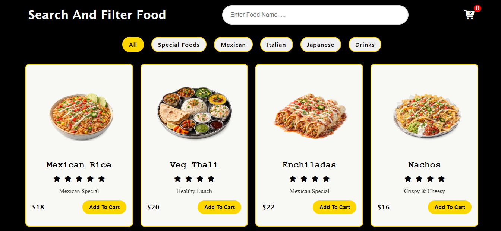
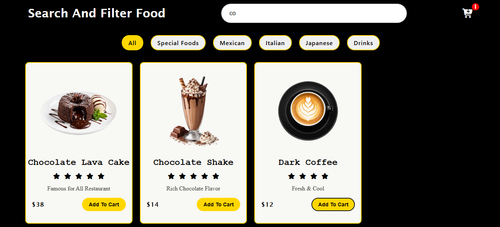
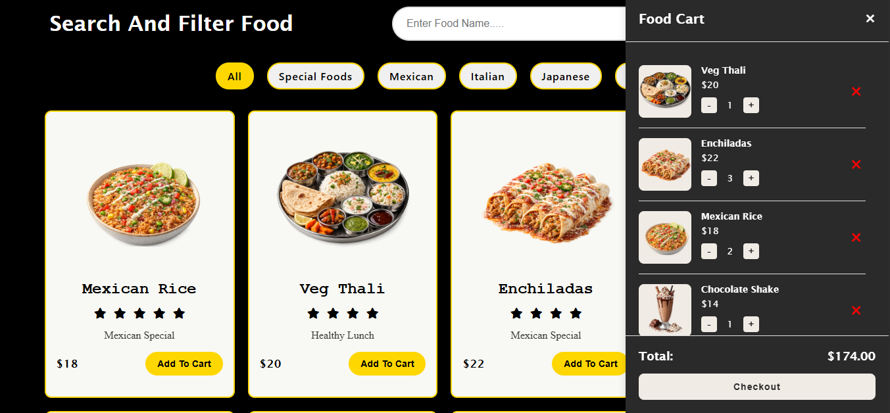

# 🍔 Food Filter – Search, Filter & Cart Food Menu

A responsive **Food Filter and Cart web application** built using **HTML, CSS, and JavaScript**. Users can search food items, filter them by category, add products to the cart, update quantities, and view the total price in a modern sidebar cart interface.

## 🚀 Features

* 🔍 **Live Search** by food name
* 🍕 **Category-based filtering**
* 🛒 **Add to Cart** functionality
* ➕ **Increase / Decrease quantity**
* 🗑️ **Remove items from cart**
* 💰 **Dynamic total price calculation**
* 🔢 **Cart item badge counter**
* 📱 **Responsive card layout**
* 🎨 **Modern dark UI with gold accents**
* ⭐ **Food rating display**
* 🍽️ **Sidebar shopping cart**
* ⚡ **Instant filtering using JavaScript**
* 🔔 **Toast notifications** for cart actions

## 🛠️ Technologies Used

* HTML5
* CSS3
* JavaScript (ES6)
* Font Awesome

## 📂 Project Structure

```text
FoodFilter/
│── index.html
│── style/
│   └── style.css
│── js/
│   └── js.js
│── images/
│   ├── chickenBiryani.png
│   ├── pepperoniPizza.png
│   ├── mojito.png
│   ├── sushiRolls.png
│   └── ...
│── preview/
│   ├── preview1.png
│   └── preview2.png
```

## 🍽️ Available Categories

* All
* Special Foods
* Mexican
* Italian
* Japanese
* Drinks

## 🛒 Cart Features

* Add food items to cart
* Automatically increase quantity for existing items
* Increase / decrease quantity
* Remove items completely
* Real-time cart badge updates
* Real-time total price updates
* Empty cart state
* Sidebar cart toggle
* Toast messages for add/remove actions

## ⚡ How It Works

1. Search food using the search bar.
2. Filter food by category.
3. Click **Add To Cart**.
4. Open the cart sidebar.
5. Update quantity or remove items.
6. View the total price instantly.

## 🔥 Current Functionalities

* Dynamic food card rendering
* Search + category filtering
* Cart sidebar
* Quantity management
* Total price calculation
* Cart badge counter
* Toast notifications
* Responsive food cards
* Font Awesome ratings
* Local Storage Functionality

## ✨ Future Improvements

🔀 Sorting

Food items can now be sorted using different options:

💰 Price: Low → High
💰 Price: High → Low
⭐ Rating: High → Low
🔤 Name: A → Z

Sorting works together with search and category filtering.

❤️ Wishlist

Users can add their favorite food items to a wishlist.

Add food to wishlist
Remove food from wishlist
Wishlist data saved in LocalStorage
Wishlist remains available after page refresh
Wishlist counter
🌙☀️ Dark / Light Mode

Added a theme toggle that allows users to switch between:

🌙 Dark Mode
☀️ Light Mode

The selected theme is saved using LocalStorage and remains active after refreshing the page.


## 📸 Preview

### Home Page


### Search Functionality


### Food Cart


## 👨‍💻 Author

**Harish Dubey**

GitHub: https://github.com/harishdubeyCS

---

⭐ If you like this project, consider giving it a **Star** on GitHub.
